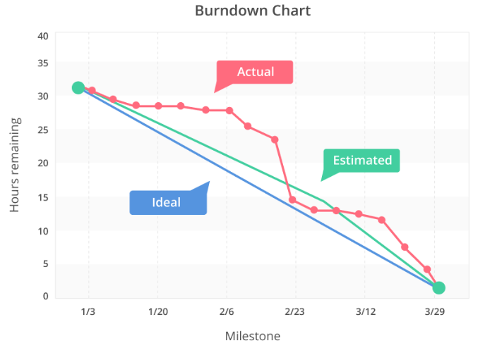

layout: post
title: Thoughts on Product Development 1
categories: [PD, PM]

As a scientist with focus on product development for the last 5 years, I've found comfort on filling several gaps and questions about managing projects and product phases, by taking classes on project management.

I wish I had known throughout these formative years, the methodologies that were at play and how most of them were not being carried efficiently and the "why's" tied to it.  Let me explain...

At a previous employer, the product managers were benchmark scientist with high level of seniority at the intersection (and fight), with the Marketing department who had their own PM's.  There was conflict on the objectives of the product as researched and proposed by the marketing department, with the resources and even the capacity to make it happen on the R&D side; and still the agenda was pushed.

I remember seeing, very detailed folders detailing each phase from Marketing Research to Biological Research, Concept Validation, Feasibility, each step of the product development laid out in the roadmaps ... and still with so much careful planning a burn-out graphic BURNING OUT! .  A Burnout graphic is a descending cummulative graphic that details how much time is left and "spent" in each phase of a project.  Time often increases due to unforseen roadbloacks consuming both budgets and resources.

 (1)

Roadblocks were consistently communicated and met with apparent backlash due to pressures from "above", to complete the product in time for the proposed launch date, so that the expected revenue could be more of a guarantee. Time is of essence in product development, as multiple companies may be developing technologies around the same problem, and sometimes those who get in first get the worm, followed by those who did it best (taking most worms), and last those who didnt launch on time and missed the opportunity of being competitive and relevant at that point. 

Communication is KEY, and so is knowledge, understanding and collaboration; and often times departments bump heads on expectations.  The end result was a product launched years after it was planned to, hitting the market and not succeeding. 

What are the other possible venues to avoid CATASTROPHE?! (IM EXAGGERATING!) ... to avoid an unsuccesful launch?

- **Trust beta testers**, accept feedback and tailor your product.

- **Consistently ask for feedback from professionals in the field**, who may be researching and seeing how things are changing in real time.  Sometimes as scientist we focus so much on what is in front of us and we are actively working on, that when we snap out of it; something new has come along.  

- **Plan and alot time for research!** you want your scientists and developers to use the state-of-the-art tools -- the most optimized and updated tools available -- and to get educated on topics that will help advance the project, and create amazing deliverables computationally produced in record time.  Often times project and product managers alot time for the actual work, but fail to understand that a lot of the questions being posed are new, and teammates need time to learn and compare methodologies that at the end will make the product more robust and trustworthy to the community.

- **Be REAL and CLEAR**. As a scientist working in a project, communicate your expectations and capabilities and how they differ with was proposed for you as the one doing the task.  A lot of times, PM may believe you possess skillsets you dont have and put you in the project with no communication if you are a good fit for the project.  Speak about it, and propose a timeline that will give you time to learn. Dont be shy! they can go back and update the timeline.  It is the job of a PM to assess who will be in the project and for what reason before initiating the project. Is also nice to have opportunities of growth! However, do ask about the urgency of the project and task and assess given the time constraints if you are the best resource for it.  Unaccounted things like this, impact delivery and target times in projects. 

- **Collaborate and Seek to Understand** Often times there are unseen professional boundaries, such as bench scientists not meddling into ins and outs of pipelines, algorithms and not seeking to understand at a high level what is happening algorithmically to the data. I've experienced being in teams where there are no discussions beforehand on the outputs and deliverables that will give them the information they need to proceed and make appropiate data-driven decisions. The same happens in reverse, bench scientist protective of their thoughs and ideas, and not open to thoughts or opinions of those that analyze their data.  All of these are issues in communication, that affect the team morale and creates power conflicts. Seek for clarity and understanding, be amicable and be open to feedback and ideas within your team.  Discuss the problems you are facing! Others might have insights you dont. We all need to be challenged in the name of science.

- **Assess if the market opportunity is still there.**  If not, go back to the drawing board see what can be improved in comparison to the competitors, that would be feasible to incorporate in a considerable amount of time to still be able to make the desired impact.

- **Abandon ship!, but learn from it!** Several projects fail due to unforseen roadblocks, but is better to communicate such problems early on in the development phase and ask for a redirection or a change in objectives, deliverables or timelines. 

Thats all folks!

Resources:
(1) https://www.linkedin.com/pulse/top-12-project-management-charts-effective-planning-mehboob-hussain-bfmwc/